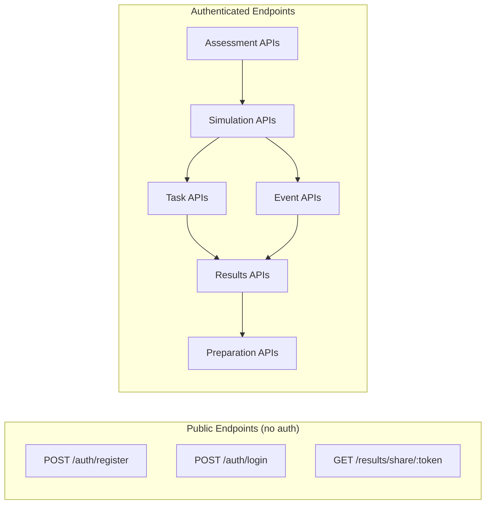
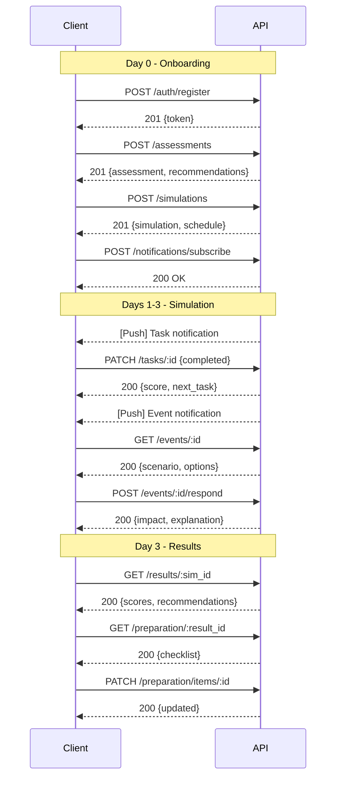

# API Design

## Document Info
- **Phase**: Design
- **Author**: PetReady Team
- **Date**: 2026-06-24
- **Status**: Draft

---

## 1. API Overview

- **Base URL**: `https://api.petready.app/v1`
- **Format**: JSON
- **Auth**: Bearer JWT token in Authorization header
- **Rate Limit**: 100 requests/min per user

---

## 2. API Data Flow Summary



---

## 3. Endpoints

### 3.1 Authentication

#### POST /auth/register
Create new account.

**Request:**
```json
{
  "email": "user@example.com",
  "password": "securePassword123",
  "name": "Jane Doe",
  "timezone": "America/New_York"
}
```

**Response (201):**
```json
{
  "user": { "id": "uuid", "email": "user@example.com", "name": "Jane Doe" },
  "token": "eyJhbG...",
  "refresh_token": "eyJhbG..."
}
```

#### POST /auth/login
```json
{ "email": "user@example.com", "password": "securePassword123" }
```

#### POST /auth/oauth/google
```json
{ "id_token": "google-oauth-token" }
```

#### POST /auth/refresh
```json
{ "refresh_token": "eyJhbG..." }
```

#### POST /auth/forgot-password
```json
{ "email": "user@example.com" }
```

---

### 3.2 Assessments

#### POST /assessments
Submit lifestyle quiz.

**Request:**
```json
{
  "responses": {
    "living_space": "apartment_small",
    "has_yard": false,
    "work_schedule": "9to5_office",
    "hours_away_daily": 9,
    "monthly_income_range": "3000-5000",
    "monthly_pet_budget": 300,
    "family_members": 1,
    "existing_pets": [],
    "travel_frequency": "monthly",
    "prior_pet_experience": "childhood_only",
    "reason_for_adopting": "companionship",
    "commitment_years": "10+"
  }
}
```

**Response (201):**
```json
{
  "id": "uuid",
  "recommended_pet_type": "cat",
  "recommended_pet_size": null,
  "sub_scores": {
    "living_space": 60,
    "financial": 75,
    "schedule": 45,
    "experience": 30
  },
  "created_at": "2026-06-24T15:30:00Z"
}
```

#### GET /assessments/latest
Get user's most recent assessment.

---

### 3.3 Simulations

#### POST /simulations
Start a new simulation.

**Request:**
```json
{
  "assessment_id": "uuid",
  "pet_type": "dog",
  "pet_size": "medium",
  "duration_days": 3
}
```

**Response (201):**
```json
{
  "id": "uuid",
  "pet_type": "dog",
  "pet_size": "medium",
  "duration_days": 3,
  "status": "active",
  "start_date": "2026-06-24T16:00:00Z",
  "end_date": "2026-06-27T16:00:00Z",
  "schedule": [
    { "day": 1, "task_count": 4 },
    { "day": 2, "task_count": 5 },
    { "day": 3, "task_count": 4 }
  ],
  "first_task": {
    "id": "uuid",
    "type": "feeding",
    "title": "Morning feeding time!",
    "scheduled_at": "2026-06-25T06:30:00Z"
  }
}
```

#### GET /simulations/active
Get currently running simulation.

**Response (200):**
```json
{
  "id": "uuid",
  "status": "active",
  "day_current": 2,
  "tasks_completed": 6,
  "tasks_total": 13,
  "tasks_missed": 1,
  "total_expenses": 145.50,
  "next_task": { "id": "uuid", "type": "walking", "scheduled_at": "..." }
}
```

#### POST /simulations/:id/pause
Pause active simulation (max 24h).

#### POST /simulations/:id/resume
Resume paused simulation.

---

### 3.4 Tasks

#### GET /simulations/:sim_id/tasks
List all tasks for a simulation.

**Response (200):**
```json
{
  "tasks": [
    {
      "id": "uuid",
      "type": "feeding",
      "title": "Morning feeding",
      "day_number": 1,
      "scheduled_at": "2026-06-25T06:30:00Z",
      "completed_at": "2026-06-25T06:34:00Z",
      "response_time_ms": 240000,
      "missed": false,
      "score": 9.2
    }
  ],
  "summary": {
    "total": 13,
    "completed": 6,
    "missed": 1,
    "pending": 6,
    "avg_response_time_ms": 320000
  }
}
```

#### PATCH /tasks/:id
Complete a task.

**Request:**
```json
{ "completed": true }
```

**Response (200):**
```json
{
  "id": "uuid",
  "completed_at": "2026-06-25T06:34:00Z",
  "response_time_ms": 240000,
  "score": 9.2,
  "message": "Great! You fed your dog within 4 minutes.",
  "next_task": { "id": "uuid", "scheduled_at": "..." }
}
```

---

### 3.5 Events

#### GET /events/:id
Get event details (when notification received).

**Response (200):**
```json
{
  "id": "uuid",
  "type": "emergency_vet",
  "severity": "high",
  "scenario": "Your dog suddenly starts vomiting and appears lethargic. They ate something from the trash earlier today.",
  "options": [
    { "id": "a", "text": "Call emergency vet immediately" },
    { "id": "b", "text": "Monitor for the next few hours" },
    { "id": "c", "text": "Search online for home remedies" }
  ],
  "triggered_at": "2026-06-25T14:22:00Z"
}
```

#### POST /events/:id/respond
Submit response to event.

**Request:**
```json
{ "choice": "a" }
```

**Response (200):**
```json
{
  "score_impact": 9.5,
  "financial_impact": 350.00,
  "explanation": "Correct decision. Vomiting with lethargy after eating unknown substances requires immediate vet attention. Early intervention often prevents expensive surgery.",
  "total_expenses_now": 495.50
}
```

---

### 3.6 Results

#### GET /results/:simulation_id
Get results for completed simulation.

**Response (200):**
```json
{
  "id": "uuid",
  "overall_score": 72,
  "score_label": "mostly_ready",
  "breakdown": {
    "time_consistency": { "score": 78, "weight": "25%", "detail": "Completed 11/13 tasks, avg response 5.3 min" },
    "financial_capacity": { "score": 65, "weight": "20%", "detail": "Budget exceeded by 15% during simulation" },
    "living_situation": { "score": 70, "weight": "15%", "detail": "Small apartment, no yard — walks essential" },
    "schedule_flexibility": { "score": 80, "weight": "15%", "detail": "Good response to unscheduled events" },
    "experience_level": { "score": 50, "weight": "10%", "detail": "Limited prior pet experience" },
    "emotional_readiness": { "score": 85, "weight": "10%", "detail": "Strong commitment indicators" },
    "household_compatibility": { "score": 70, "weight": "5%", "detail": "No existing pets, single household" }
  },
  "strengths": [
    "Excellent morning routine consistency",
    "Quick response to emergency scenarios",
    "Strong emotional commitment"
  ],
  "gaps": [
    "Budget strain — consider building emergency fund",
    "Midday tasks often delayed (work hours conflict)",
    "Limited experience — training knowledge needed"
  ],
  "recommendations": [...],
  "share_url": "https://petready.app/share/abc123def456"
}
```

#### GET /results/share/:token
Public shareable results (no auth required, limited data).

---

### 3.7 Preparation

#### GET /preparation/:result_id
Get preparation checklist.

**Response (200):**
```json
{
  "items": [
    {
      "id": "uuid",
      "category": "financial",
      "action_item": "Open a dedicated pet savings account with $500 minimum",
      "timeframe": "Before adopting",
      "completed": false
    },
    {
      "id": "uuid",
      "category": "time",
      "action_item": "Research dog walkers in your area for midday breaks",
      "timeframe": "1 week",
      "completed": true,
      "completed_at": "2026-06-28T10:00:00Z"
    }
  ],
  "progress": { "total": 8, "completed": 3, "percentage": 37 }
}
```

#### PATCH /preparation/items/:id
Mark item as completed.

```json
{ "completed": true }
```

---

### 3.8 Notifications

#### POST /notifications/subscribe
Register push subscription.

**Request:**
```json
{
  "subscription": {
    "endpoint": "https://fcm.googleapis.com/...",
    "keys": { "p256dh": "...", "auth": "..." }
  }
}
```

#### PATCH /notifications/preferences
Update notification preferences.

```json
{
  "push_enabled": true,
  "email_fallback": true,
  "quiet_hours_start": "22:00",
  "quiet_hours_end": "06:00"
}
```

---

## 4. Error Response Format

All errors follow consistent format:

```json
{
  "error": {
    "code": "SIMULATION_ALREADY_ACTIVE",
    "message": "You already have an active simulation. Complete or abandon it first.",
    "details": { "active_simulation_id": "uuid" }
  }
}
```

### Error Codes

| Code | HTTP Status | Meaning |
|------|-------------|---------|
| VALIDATION_ERROR | 400 | Request body validation failed |
| UNAUTHORIZED | 401 | Missing or invalid token |
| FORBIDDEN | 403 | Valid token but insufficient permissions |
| NOT_FOUND | 404 | Resource doesn't exist |
| SIMULATION_ALREADY_ACTIVE | 409 | Can only have one active simulation |
| SIMULATION_NOT_ACTIVE | 409 | Trying to complete task on inactive sim |
| RATE_LIMITED | 429 | Too many requests |
| INTERNAL_ERROR | 500 | Unexpected server error |

---

## 5. API Request Flow Diagrams

### Complete User Journey API Calls


