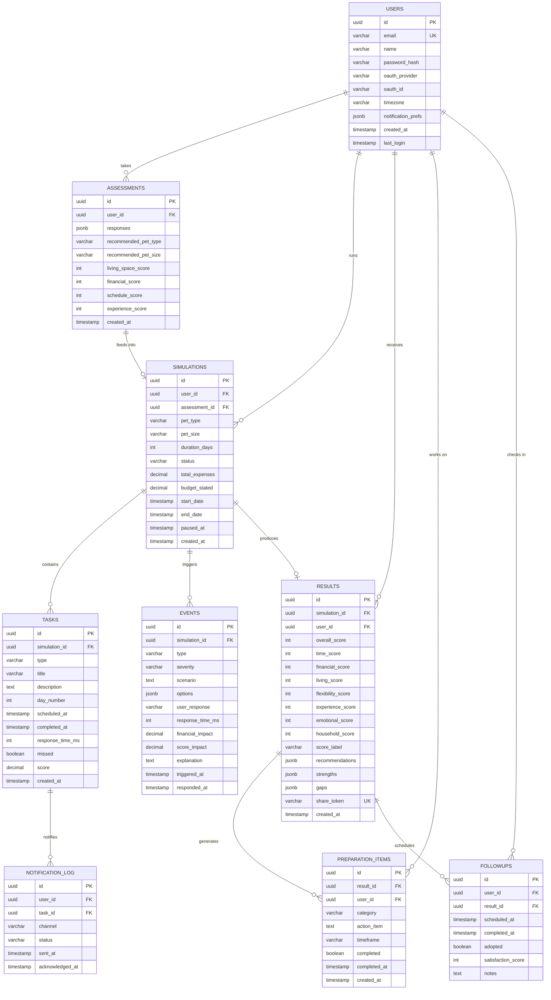
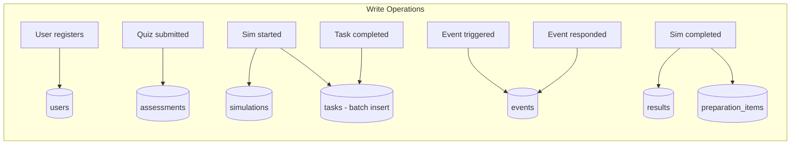
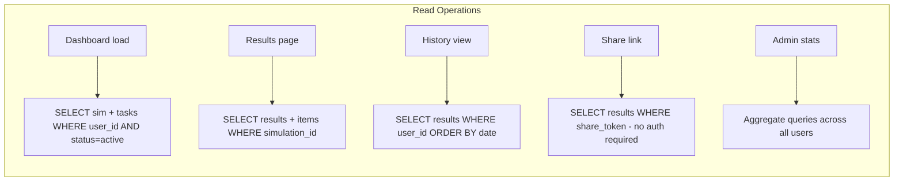
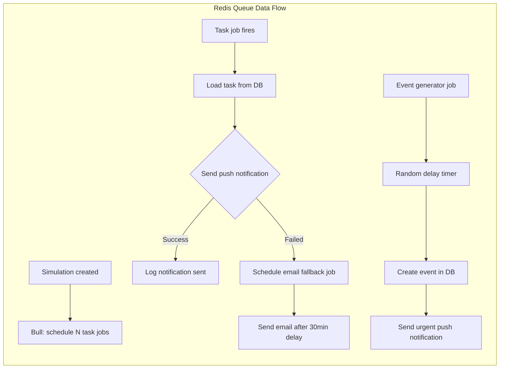
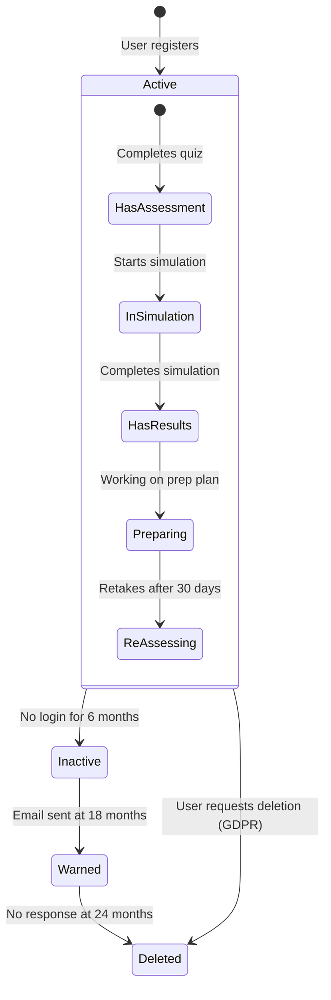

# Database Design

## Document Info
- **Phase**: Design
- **Author**: PetReady Team
- **Date**: 2026-06-24
- **Status**: Draft

---

## 1. Entity Relationship Diagram



---

## 2. Table Definitions

### 2.1 users

| Column | Type | Constraints | Description |
|--------|------|-------------|-------------|
| id | UUID | PK, DEFAULT gen_random_uuid() | Unique user identifier |
| email | VARCHAR(255) | UNIQUE, NOT NULL | Login email |
| name | VARCHAR(100) | NOT NULL | Display name |
| password_hash | VARCHAR(255) | NULLABLE | bcrypt hash (null for OAuth users) |
| oauth_provider | VARCHAR(50) | NULLABLE | 'google', 'github', etc. |
| oauth_id | VARCHAR(255) | NULLABLE | Provider's user ID |
| timezone | VARCHAR(50) | DEFAULT 'UTC' | IANA timezone string |
| notification_prefs | JSONB | DEFAULT '{}' | Push/email preferences |
| created_at | TIMESTAMPTZ | DEFAULT NOW() | Registration time |
| last_login | TIMESTAMPTZ | | Last login time |

### 2.2 assessments

| Column | Type | Constraints | Description |
|--------|------|-------------|-------------|
| id | UUID | PK | Assessment identifier |
| user_id | UUID | FK → users.id, NOT NULL | Who took it |
| responses | JSONB | NOT NULL | Full quiz answers |
| recommended_pet_type | VARCHAR(50) | | System recommendation |
| recommended_pet_size | VARCHAR(20) | | small/medium/large |
| living_space_score | INT | | Pre-calculated sub-score |
| financial_score | INT | | Pre-calculated sub-score |
| schedule_score | INT | | Pre-calculated sub-score |
| experience_score | INT | | Pre-calculated sub-score |
| created_at | TIMESTAMPTZ | DEFAULT NOW() | |

### 2.3 simulations

| Column | Type | Constraints | Description |
|--------|------|-------------|-------------|
| id | UUID | PK | Simulation identifier |
| user_id | UUID | FK → users.id | Owner |
| assessment_id | UUID | FK → assessments.id | Linked assessment |
| pet_type | VARCHAR(20) | NOT NULL | dog, cat, bird, rabbit |
| pet_size | VARCHAR(20) | | small, medium, large |
| duration_days | INT | NOT NULL, DEFAULT 3 | 3 or 7 |
| status | VARCHAR(20) | NOT NULL | active, paused, completed, abandoned |
| total_expenses | DECIMAL(10,2) | DEFAULT 0 | Running expense tally |
| budget_stated | DECIMAL(10,2) | | User's stated monthly budget |
| start_date | TIMESTAMPTZ | NOT NULL | When simulation began |
| end_date | TIMESTAMPTZ | | When simulation ended |
| paused_at | TIMESTAMPTZ | | If currently paused |
| created_at | TIMESTAMPTZ | DEFAULT NOW() | |

### 2.4 tasks

| Column | Type | Constraints | Description |
|--------|------|-------------|-------------|
| id | UUID | PK | Task identifier |
| simulation_id | UUID | FK → simulations.id | Parent simulation |
| type | VARCHAR(30) | NOT NULL | feeding, walking, grooming, play, training |
| title | VARCHAR(200) | NOT NULL | Display title |
| description | TEXT | | Detailed instruction |
| day_number | INT | NOT NULL | Which day (1, 2, 3...) |
| scheduled_at | TIMESTAMPTZ | NOT NULL | When notification fires |
| completed_at | TIMESTAMPTZ | | When user completed |
| response_time_ms | INT | | Milliseconds from notification to completion |
| missed | BOOLEAN | DEFAULT false | Not completed in time window |
| score | DECIMAL(5,2) | | Task score (0–10) |
| created_at | TIMESTAMPTZ | DEFAULT NOW() | |

### 2.5 events

| Column | Type | Constraints | Description |
|--------|------|-------------|-------------|
| id | UUID | PK | Event identifier |
| simulation_id | UUID | FK → simulations.id | Parent simulation |
| type | VARCHAR(50) | NOT NULL | emergency_vet, behavioral, schedule_conflict, property_damage, multi_pet_conflict |
| severity | VARCHAR(20) | NOT NULL | low, medium, high, critical |
| scenario | TEXT | NOT NULL | Narrative description shown to user |
| options | JSONB | NOT NULL | Array of {id, text, score, cost, explanation} |
| user_response | VARCHAR(50) | | Which option user chose |
| response_time_ms | INT | | Time to respond |
| financial_impact | DECIMAL(10,2) | DEFAULT 0 | Cost added to simulation |
| score_impact | DECIMAL(5,2) | | Points added/deducted |
| explanation | TEXT | | Educational explanation shown after |
| triggered_at | TIMESTAMPTZ | NOT NULL | When event appeared |
| responded_at | TIMESTAMPTZ | | When user responded |

### 2.6 results

| Column | Type | Constraints | Description |
|--------|------|-------------|-------------|
| id | UUID | PK | Result identifier |
| simulation_id | UUID | FK → simulations.id, UNIQUE | One result per simulation |
| user_id | UUID | FK → users.id | For quick lookup |
| overall_score | INT | NOT NULL | 0–100 |
| time_score | INT | | 0–100 sub-score |
| financial_score | INT | | 0–100 sub-score |
| living_score | INT | | 0–100 sub-score |
| flexibility_score | INT | | 0–100 sub-score |
| experience_score | INT | | 0–100 sub-score |
| emotional_score | INT | | 0–100 sub-score |
| household_score | INT | | 0–100 sub-score |
| score_label | VARCHAR(30) | | highly_ready, mostly_ready, needs_preparation, not_ready |
| recommendations | JSONB | | Personalized advice array |
| strengths | JSONB | | What user did well |
| gaps | JSONB | | Areas needing improvement |
| share_token | VARCHAR(32) | UNIQUE | For public share URL |
| created_at | TIMESTAMPTZ | DEFAULT NOW() | |

---

## 3. Data Flow: Write Paths



## 4. Data Flow: Read Paths



## 5. Data Flow: Queue Operations



---

## 6. Indexes

```sql
-- Performance-critical indexes
CREATE INDEX idx_simulations_user_status ON simulations(user_id, status);
CREATE INDEX idx_tasks_simulation_scheduled ON tasks(simulation_id, scheduled_at);
CREATE INDEX idx_tasks_simulation_missed ON tasks(simulation_id) WHERE missed = true;
CREATE INDEX idx_events_simulation ON events(simulation_id);
CREATE INDEX idx_results_user ON results(user_id);
CREATE INDEX idx_results_share_token ON results(share_token);
CREATE INDEX idx_notification_log_task ON notification_log(task_id);
CREATE INDEX idx_preparation_items_user ON preparation_items(user_id, completed);
```

---

## 7. Data Retention & Lifecycle



---

## 8. JSONB Schema Examples

### assessments.responses
```json
{
  "living_space": "apartment_small",
  "has_yard": false,
  "work_schedule": "9to5_office",
  "hours_away_daily": 9,
  "monthly_income_range": "3000-5000",
  "monthly_pet_budget": 300,
  "family_members": 1,
  "existing_pets": [],
  "travel_frequency": "monthly",
  "prior_pet_experience": "childhood_only",
  "reason_for_adopting": "companionship",
  "commitment_years": "10+"
}
```

### events.options
```json
[
  {
    "id": "a",
    "text": "Rush to emergency vet immediately",
    "score": 10,
    "cost": 400,
    "explanation": "Correct. Limping with swelling requires immediate veterinary attention."
  },
  {
    "id": "b",
    "text": "Wait and see if it improves by tomorrow",
    "score": 4,
    "cost": 0,
    "explanation": "Risky. Delayed treatment can worsen injuries and increase costs."
  },
  {
    "id": "c",
    "text": "Google the symptoms and try home treatment",
    "score": 2,
    "cost": 50,
    "explanation": "Dangerous. Misdiagnosis can lead to permanent damage."
  }
]
```

### results.recommendations
```json
[
  {
    "category": "financial",
    "priority": "high",
    "message": "Build an emergency pet fund of at least $500 before adopting",
    "evidence": "You hesitated on the emergency vet scenario and your stated budget is tight"
  },
  {
    "category": "time",
    "priority": "medium",
    "message": "Consider a dog walker for midday breaks during work hours",
    "evidence": "Midday tasks had the longest response times (avg 47 min)"
  }
]
```
