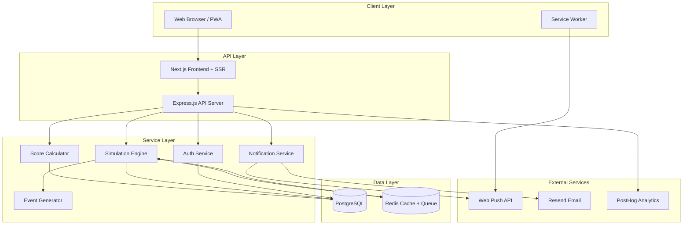
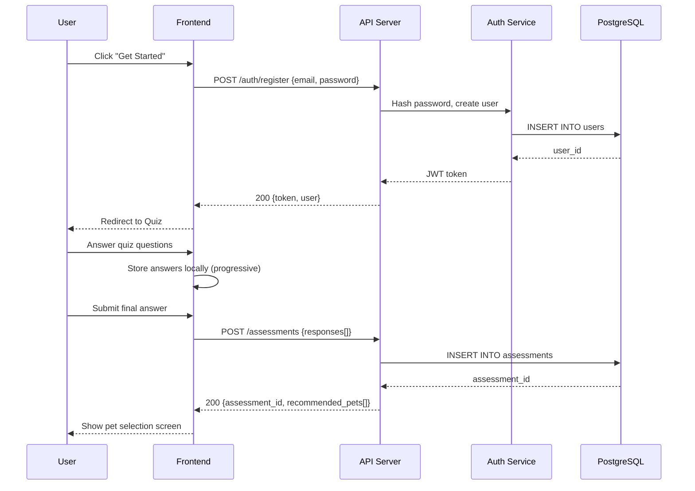
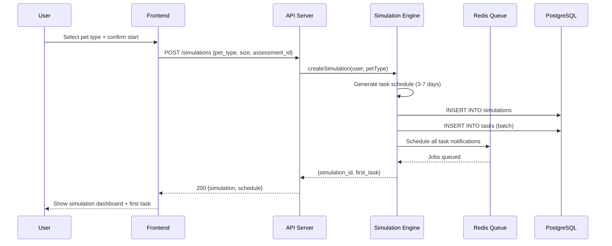
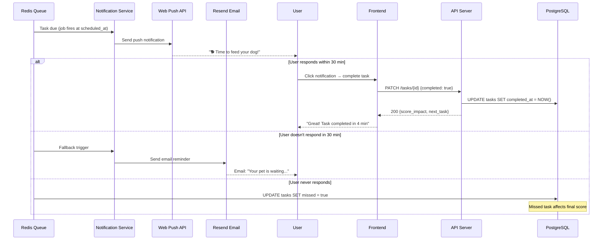
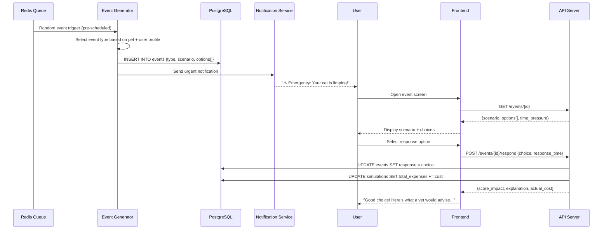
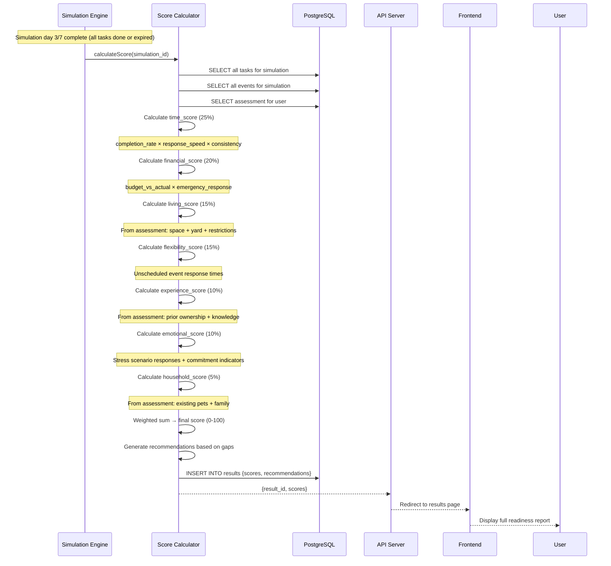
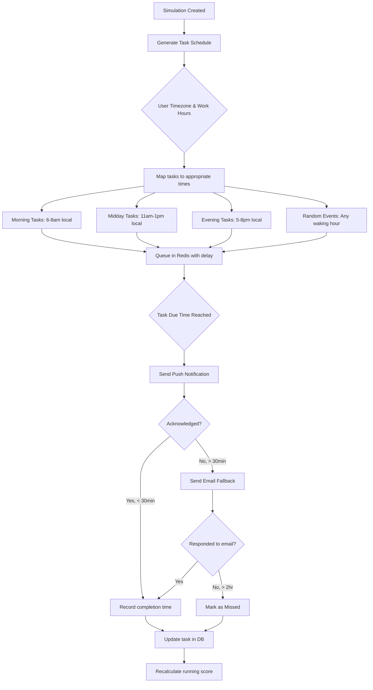
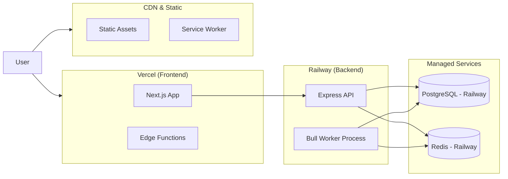

# System Architecture

## Document Info
- **Phase**: Design
- **Author**: PetReady Team
- **Date**: 2026-06-24
- **Status**: Draft

---

## 1. High-Level Architecture

---

## 2. Component Responsibilities

| Component | Responsibility |
|-----------|---------------|
| **Next.js Frontend** | SSR pages, quiz UI, simulation dashboard, results display |
| **Express API** | REST endpoints, request validation, routing |
| **Auth Service** | Registration, login, JWT management, OAuth |
| **Simulation Engine** | Creates/manages simulation state, schedules tasks, handles progression |
| **Event Generator** | Random unexpected event creation with timing logic |
| **Score Calculator** | Aggregates simulation data into weighted readiness score |
| **Notification Service** | Dispatches push notifications and email fallbacks |
| **PostgreSQL** | Persistent storage for all domain data |
| **Redis** | Task queue (Bull), session cache, rate limiting |

---

## 3. Data Flow Diagrams

### 3.1 User Registration & Assessment Flow

### 3.2 Simulation Start Flow

### 3.3 Task Notification & Completion Flow

### 3.4 Unexpected Event Flow

### 3.5 Score Calculation Flow

### 3.6 Notification Scheduling Flow

---

## 4. Technology Stack Decisions

| Layer | Choice | Alternatives Considered | Why This |
|-------|--------|------------------------|----------|
| Frontend | Next.js 14 | Remix, SvelteKit | Best SSR + React ecosystem |
| Styling | Tailwind CSS | Chakra UI, MUI | Speed, no JS overhead |
| Backend | Express.js | Fastify, Nest.js | Simple, well-known, fast MVP |
| Database | PostgreSQL | MongoDB, MySQL | Relational data, JSONB for flexibility |
| Queue | Bull (Redis) | BullMQ, RabbitMQ | Simple, proven for scheduled jobs |
| Cache | Redis | Memcached | Also serves as queue backend |
| Auth | NextAuth.js | Auth0, Firebase Auth | Free, extensible, self-hosted |
| Push | web-push (npm) | Firebase FCM | Standards-based, no vendor lock |
| Email | Resend | SendGrid, SES | Modern DX, good free tier |
| Hosting | Vercel + Railway | AWS, Render | Fast deploys, affordable MVP |
| Analytics | PostHog | Mixpanel, Amplitude | Open-source, self-hostable |
| Monitoring | Sentry | Datadog, New Relic | Free tier, great error tracking |

---

## 5. Deployment Architecture

