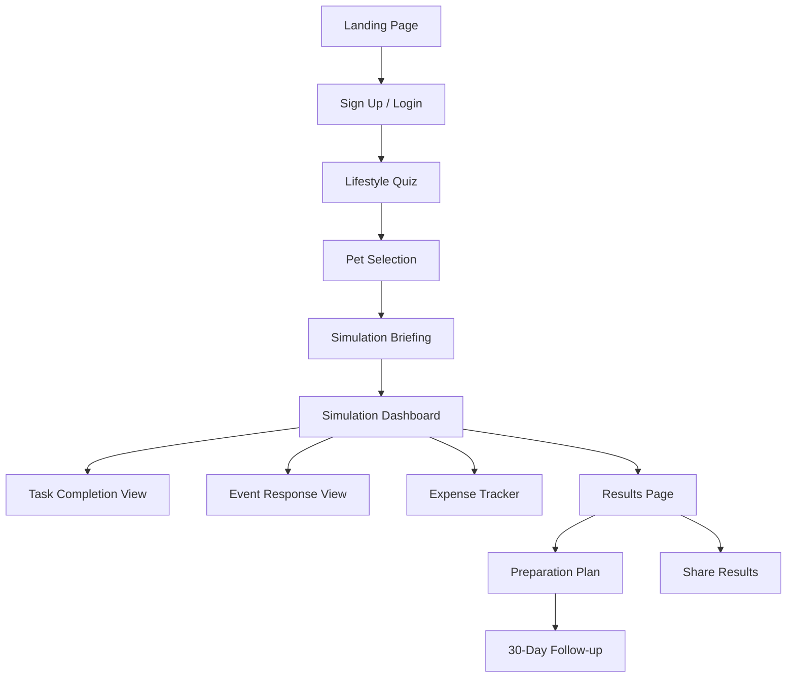

# UI/UX Wireframes & Design

## Document Info
- **Phase**: Design
- **Author**: PetReady Team
- **Date**: 2026-06-24
- **Status**: Draft

---

## 1. Screen Flow



---

## 2. Key Screens

### 2.1 Landing Page

```
┌─────────────────────────────────────────────────┐
│  🐾 PetReady                        [Login]     │
├─────────────────────────────────────────────────┤
│                                                 │
│    Are you REALLY ready for a pet?              │
│                                                 │
│    Don't guess. Experience it first.            │
│    Our 3-day simulation shows you what          │
│    pet ownership actually feels like.           │
│                                                 │
│         [ Start Free Simulation ]               │
│                                                 │
│    ✓ 3-day realistic simulation                 │
│    ✓ Push notifications at real task times      │
│    ✓ Personalized readiness score               │
│    ✓ No app download needed                     │
│                                                 │
├─────────────────────────────────────────────────┤
│  How It Works:                                  │
│  [1. Quiz] → [2. Simulate] → [3. Score]        │
├─────────────────────────────────────────────────┤
│  "I thought I was ready. PetReady showed me     │
│   3 things I hadn't considered." — Sarah, 28    │
└─────────────────────────────────────────────────┘
```

### 2.2 Lifestyle Quiz

```
┌─────────────────────────────────────────────────┐
│  🐾 PetReady          Question 4 of 12          │
├─────────────────────────────────────────────────┤
│  ████████░░░░░░░░░░░░  33%                      │
│                                                 │
│  How many hours are you away from home          │
│  on a typical workday?                          │
│                                                 │
│  ┌─────────────────────────────────────┐        │
│  │  ○  Less than 4 hours               │        │
│  │  ○  4–6 hours                        │        │
│  │  ● 6–9 hours                        │        │
│  │  ○  9–12 hours                       │        │
│  │  ○  12+ hours                        │        │
│  └─────────────────────────────────────┘        │
│                                                 │
│  💡 Dogs need human contact. Being alone        │
│     8+ hours needs a plan (walker, daycare).    │
│                                                 │
│       [← Back]              [Next →]            │
└─────────────────────────────────────────────────┘
```

### 2.3 Simulation Dashboard

```
┌─────────────────────────────────────────────────┐
│  🐾 PetReady     Day 2 of 3     [Pause ⏸]      │
├─────────────────────────────────────────────────┤
│                                                 │
│  Your virtual dog: Medium Labrador 🐕           │
│                                                 │
│  ┌─── Today's Tasks ──────────────────────┐     │
│  │  ✅ 6:30am  Morning feeding        +9.2 │     │
│  │  ✅ 7:00am  Morning walk           +8.8 │     │
│  │  ⏳ 12:00pm Midday check-in     PENDING │     │
│  │  ○  5:30pm  Evening feeding              │     │
│  │  ○  7:00pm  Play & training              │     │
│  └──────────────────────────────────────────┘     │
│                                                 │
│  ┌─── Progress ───────────────────────────┐     │
│  │  Tasks: 8/13 completed                   │     │
│  │  Missed: 1                               │     │
│  │  Avg response: 4.2 min                   │     │
│  │  Expenses: $145.50 / $300 budget         │     │
│  └──────────────────────────────────────────┘     │
│                                                 │
│  ⚠️ UNEXPECTED EVENT                            │
│  "Your dog is scratching furniture..."          │
│  [Respond Now →]                                │
│                                                 │
└─────────────────────────────────────────────────┘
```

### 2.4 Event Response Screen

```
┌─────────────────────────────────────────────────┐
│  ⚠️ UNEXPECTED EVENT           Respond in: 2:34  │
├─────────────────────────────────────────────────┤
│                                                 │
│  🐕 Your dog just vomited and appears           │
│  lethargic. Earlier today they got into         │
│  the trash while you were at work.              │
│                                                 │
│  What do you do?                                │
│                                                 │
│  ┌─────────────────────────────────────┐        │
│  │  A) Call emergency vet immediately   │        │
│  │                                     │        │
│  │  B) Wait a few hours to see if      │        │
│  │     they improve                    │        │
│  │                                     │        │
│  │  C) Google symptoms and try home    │        │
│  │     remedies                        │        │
│  └─────────────────────────────────────┘        │
│                                                 │
│  [Submit Response]                              │
│                                                 │
└─────────────────────────────────────────────────┘
```

### 2.5 Results Page

```
┌─────────────────────────────────────────────────┐
│  🐾 PetReady          Simulation Complete! 🎉   │
├─────────────────────────────────────────────────┤
│                                                 │
│         Your Readiness Score                    │
│                                                 │
│              ┌─────┐                            │
│              │ 72  │                            │
│              └─────┘                            │
│          MOSTLY READY                           │
│                                                 │
│  ┌─── Score Breakdown ────────────────────┐     │
│  │  Time Consistency    ████████░░  78%    │     │
│  │  Financial Capacity  ██████░░░░  65%    │     │
│  │  Living Situation    ███████░░░  70%    │     │
│  │  Flexibility         ████████░░  80%    │     │
│  │  Experience          █████░░░░░  50%    │     │
│  │  Emotional Ready     █████████░  85%    │     │
│  │  Household Compat    ███████░░░  70%    │     │
│  └──────────────────────────────────────────┘     │
│                                                 │
│  💪 Strengths:                                  │
│  • Excellent morning routine                    │
│  • Quick emergency responses                    │
│  • Strong emotional commitment                  │
│                                                 │
│  ⚡ Areas to Improve:                           │
│  • Build emergency pet fund ($500+)             │
│  • Plan for midday care (dog walker?)           │
│  • Take basic training course                   │
│                                                 │
│  [View Preparation Plan]  [Share Results 📤]    │
│                                                 │
└─────────────────────────────────────────────────┘
```

---

## 3. Design Principles

| Principle | Implementation |
|-----------|---------------|
| Guidance, not judgement | No red "FAIL" screens. Use encouraging language with honesty. |
| Progressive disclosure | Show one question at a time. Reveal complexity gradually. |
| Mobile-first | Design for 375px width first, scale up. |
| Instant feedback | Every action gets immediate visual response. |
| Accessible | WCAG 2.1 AA, high contrast, keyboard nav, screen readers. |
| Minimal friction | One-click task completion. No unnecessary screens. |

---

## 4. Color Palette

| Use | Color | Hex |
|-----|-------|-----|
| Primary (trust, calm) | Teal | #0D9488 |
| Secondary (warmth) | Amber | #F59E0B |
| Success | Green | #10B981 |
| Warning | Orange | #F97316 |
| Danger/Urgent | Red | #EF4444 |
| Background | Light gray | #F9FAFB |
| Text | Dark gray | #1F2937 |
| Muted | Gray | #6B7280 |

---

## 5. Component Library

Using **Tailwind CSS** with custom design tokens. Key components:

- **QuizCard** — Single question with options
- **TaskCard** — Simulation task with status indicator
- **EventModal** — Urgent event overlay with timer
- **ScoreGauge** — Circular score visualization
- **ProgressBar** — Multi-step progress indicator
- **NotificationBanner** — In-app notification display
- **ChecklistItem** — Toggleable preparation item
