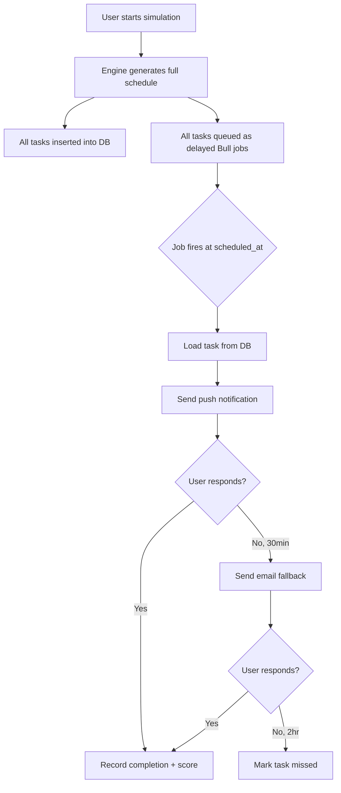
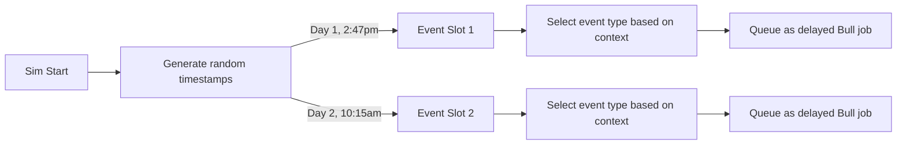
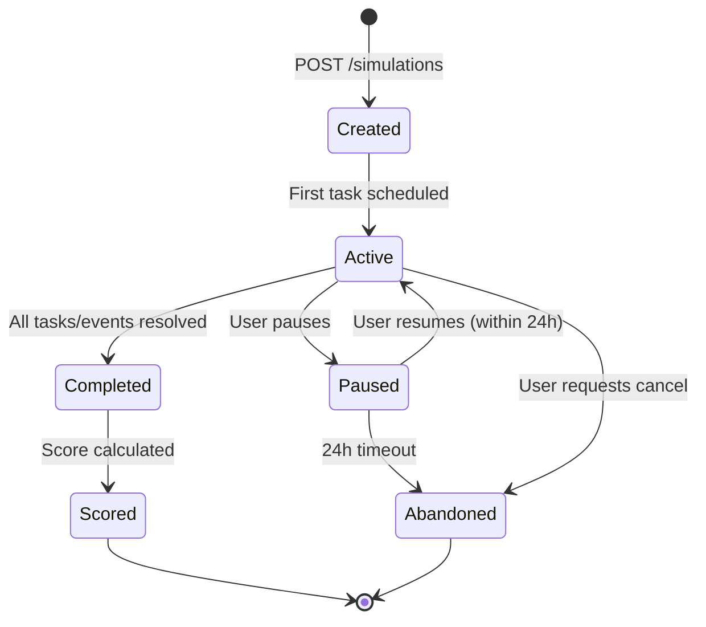

# ADR-002: Simulation Engine Design

## Status
**Accepted** — 2026-06-24

## Context

PetReady's core differentiator is a multi-day simulation that sends timed tasks and unexpected events to users. The simulation engine must:

- Schedule 3–5 tasks per day for 3–7 days per user
- Deliver notifications at specific times (adapted to user timezone)
- Generate random unexpected events at unpredictable times
- Track task completion, response time, and missed tasks
- Handle concurrent simulations for many users
- Allow pausing/resuming without corrupting state

This is the most architecturally significant component — if it fails, the product fails.

## Decision

### Architecture: Pre-scheduled Job Queue Pattern

### Key Design Decisions

#### 1. Pre-schedule all tasks at simulation start
- When user starts a simulation, ALL tasks for all days are generated immediately
- Each task gets a specific `scheduled_at` timestamp
- All are queued as delayed Bull jobs

**Why**: Simpler than computing tasks on-the-fly. Allows preview of full schedule. Pause/resume just adjusts timestamps.

#### 2. Tasks are timezone-aware
- User's timezone is captured at registration
- Task times are calculated relative to user's local time
- Stored as UTC in DB, converted for display

**Example**: User in EST with `work_schedule: "9to5"`:
- Morning feed: 6:30am EST → queued for 11:30 UTC
- Midday check: 12:00pm EST → queued for 17:00 UTC
- Evening feed: 6:00pm EST → queued for 23:00 UTC

#### 3. Unexpected events use separate random scheduler
- At simulation start, 1–2 event trigger times are randomly selected
- Events fire at genuinely unpredictable moments (any waking hour)
- Event type selected based on pet type + user profile + day number

#### 4. Scoring is calculated at completion, not real-time
- Running score shown during simulation is an estimate
- Final score calculated after last task/event completes
- Uses weighted algorithm (defined in Score Calculator service)

#### 5. Pause/Resume shifts all future timestamps
- When user pauses: record `paused_at`, cancel all pending Bull jobs
- When user resumes: calculate time delta, shift all remaining task `scheduled_at` by delta, re-queue

## Alternatives Considered

### Alternative A: On-demand task generation (cron-based)
Run a cron job every hour that checks "which users need a task right now?" and generates/sends them.

**Rejected because**:
- Race conditions with multiple workers
- Can't show user their full schedule preview
- Harder to pause/resume
- Polling is wasteful for sparse events

### Alternative B: Real-time WebSocket simulation
Keep a persistent WebSocket connection and push tasks in real-time.

**Rejected because**:
- Users won't keep browser open for 3–7 days
- Massive connection overhead at scale
- Push notifications work better for this use case (user is away from app)

### Alternative C: Third-party workflow engine (Temporal, Inngest)
Use a dedicated workflow orchestration tool.

**Rejected because**:
- Overkill for MVP complexity
- Additional cost and operational overhead
- Learning curve for unfamiliar technology
- **Reconsidered for Phase 3** if we hit Bull's limits

## Simulation State Machine

## Task Type Definitions

| Type | Frequency | Time Window | Score Weight |
|------|-----------|-------------|-------------|
| feeding | 2x daily | Morning + Evening | High |
| walking | 1–2x daily | Morning + optional midday | High |
| grooming | 1x every other day | Evening | Medium |
| play | 1x daily | Evening | Medium |
| training | 1x daily | Flexible | Medium |
| vet_appointment | 1x per simulation | Pre-scheduled | Low |
| supply_purchase | 1x per simulation | Flexible | Low |

## Event Type Pool

| Type | Severity | Financial Impact | Trigger Condition |
|------|----------|-----------------|-------------------|
| emergency_vet | High | $200–$800 | Random |
| behavioral_incident | Medium | $0–$100 | Day 2+ |
| noise_complaint | Medium | $0 | Dog simulations only |
| property_damage | Medium | $50–$300 | Random |
| schedule_conflict | Low | $0 | During work hours |
| supply_shortage | Low | $30–$80 | Random |
| multi_pet_conflict | High | $100–$400 | Only if existing pets |

## Consequences

### Positive
- Predictable, testable behavior (all tasks known at start)
- Easy to show schedule preview to user
- Pause/resume is a simple timestamp shift
- Bull handles retries, dead letter queue automatically
- Can replay/debug any simulation by examining DB state

### Negative
- Pre-scheduling means changing task logic requires migration for active sims
- Bull job IDs must be tracked for pause/resume (cancel + re-queue)
- Redis memory grows with active simulations (mitigated: jobs are small)

### Trade-offs Accepted
- Sacrificing dynamic adaptation (tasks don't change based on mid-sim behavior) for simplicity
- Accepted that "random" events are pre-determined (but user doesn't know this)
- Accepted Redis as single point of failure for queue (mitigated: Redis persistence enabled)
