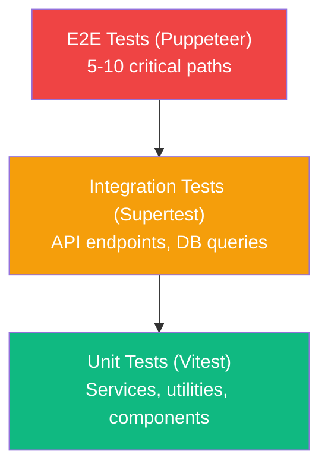
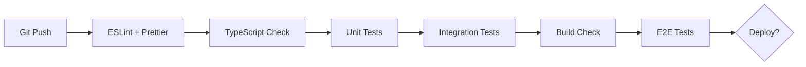

# Test Strategy

## Document Info
- **Phase**: Testing
- **Author**: PetReady Team
- **Date**: 2026-06-24
- **Status**: Draft

---

## 1. Testing Pyramid



| Layer | Tool | Count Target | Run Time |
|-------|------|-------------|----------|
| Unit | Vitest | 200+ tests | < 30s |
| Integration | Vitest + Supertest | 50+ tests | < 2min |
| E2E | Puppeteer | 10–15 tests | < 5min |
| Component | React Testing Library | 30+ tests | < 30s |

---

## 2. Unit Tests

### What to Test

| Module | Test Focus |
|--------|-----------|
| Score Calculator | Weighted formula, edge cases (0 tasks, all missed) |
| Task Scheduler | Timezone conversion, work-hour avoidance, correct spacing |
| Event Generator | Random selection, severity distribution, financial impact |
| Validation schemas | Valid/invalid inputs for all Zod schemas |
| Utilities | Date helpers, formatters, token generation |

### Example

```typescript
describe('ScoreCalculator', () => {
  it('returns 0 when all tasks are missed', () => {
    const tasks = createMockTasks({ allMissed: true });
    const score = calculateTimeScore(tasks);
    expect(score).toBe(0);
  });

  it('weights time consistency at 25%', () => {
    const result = calculateOverallScore({
      timeScore: 100,
      financialScore: 0,
      livingScore: 0,
      flexibilityScore: 0,
      experienceScore: 0,
      emotionalScore: 0,
      householdScore: 0,
    });
    expect(result).toBe(25);
  });
});
```

---

## 3. Integration Tests

### What to Test

| Endpoint | Scenarios |
|----------|-----------|
| POST /auth/register | Valid registration, duplicate email, weak password |
| POST /assessments | Valid submission, missing fields, invalid values |
| POST /simulations | Successful start, already-active conflict, missing assessment |
| PATCH /tasks/:id | Complete task, task not found, wrong user, already completed |
| POST /events/:id/respond | Valid response, timeout, invalid choice |
| GET /results/:id | Successful retrieval, not found, unauthorized |

### Example

```typescript
describe('POST /simulations', () => {
  it('creates simulation with scheduled tasks', async () => {
    const res = await request(app)
      .post('/v1/simulations')
      .set('Authorization', `Bearer ${token}`)
      .send({ assessment_id: assessmentId, pet_type: 'dog', pet_size: 'medium', duration_days: 3 });

    expect(res.status).toBe(201);
    expect(res.body.status).toBe('active');
    expect(res.body.schedule).toHaveLength(3);

    // Verify tasks were created in DB
    const tasks = await db.tasks.findBySimulation(res.body.id);
    expect(tasks.length).toBeGreaterThanOrEqual(9); // 3+ tasks per day
  });

  it('rejects when simulation already active', async () => {
    const res = await request(app)
      .post('/v1/simulations')
      .set('Authorization', `Bearer ${token}`)
      .send({ assessment_id: assessmentId, pet_type: 'cat', duration_days: 3 });

    expect(res.status).toBe(409);
    expect(res.body.error.code).toBe('SIMULATION_ALREADY_ACTIVE');
  });
});
```

---

## 4. End-to-End Tests (Puppeteer)

### Critical Paths

| Test | Steps |
|------|-------|
| Full onboarding | Register → Quiz → Select pet → Start simulation |
| Task completion | Receive notification → Open dashboard → Complete task |
| Event response | Event appears → Read scenario → Select option → See result |
| View results | Complete simulation → See score → View breakdown |
| Share results | Get share link → Open in incognito → Verify public view |

### Setup

```typescript
// puppeteer.config.ts
import puppeteer from 'puppeteer';

const browser = await puppeteer.launch({
  headless: true,
  args: ['--no-sandbox', '--disable-setuid-sandbox'],
});

// Test: Full onboarding flow
describe('Onboarding E2E', () => {
  it('completes registration through simulation start', async () => {
    const page = await browser.newPage();
    await page.goto('http://localhost:3000');

    // Register
    await page.click('[data-testid="get-started"]');
    await page.type('[name="email"]', 'test@example.com');
    await page.type('[name="password"]', 'SecurePass123!');
    await page.click('[data-testid="register-submit"]');

    // Quiz
    await page.waitForSelector('[data-testid="quiz-question"]');
    // ... complete quiz steps

    // Start simulation
    await page.click('[data-testid="start-simulation"]');
    await page.waitForSelector('[data-testid="simulation-dashboard"]');

    expect(await page.textContent('[data-testid="sim-status"]')).toBe('Active');
  });
});
```

---

## 5. Test Data Strategy

### Factories

```typescript
// tests/factories/simulation.factory.ts
export function createMockSimulation(overrides?: Partial<Simulation>): Simulation {
  return {
    id: randomUUID(),
    userId: randomUUID(),
    petType: 'dog',
    petSize: 'medium',
    durationDays: 3,
    status: 'active',
    totalExpenses: 0,
    startDate: new Date(),
    ...overrides,
  };
}
```

### Test Database

- Use separate PostgreSQL database for tests (`petready_test`)
- Migrations run before test suite
- Each test uses transaction rollback for isolation
- Seed data loaded for integration tests

---

## 6. CI Pipeline Testing



### GitHub Actions

```yaml
# Runs on every PR
- Lint + format check
- TypeScript compilation
- Unit tests (Vitest)
- Integration tests (needs PostgreSQL + Redis services)
- Build verification

# Runs on merge to main
- All above + E2E tests (Puppeteer)
- Deploy to staging
```

---

## 7. Quality Gates

| Gate | Threshold | Blocks Deploy? |
|------|-----------|---------------|
| Unit test pass rate | 100% | Yes |
| Integration test pass rate | 100% | Yes |
| Code coverage (core logic) | >80% | Yes |
| E2E test pass rate | 100% | Yes |
| No TypeScript errors | 0 errors | Yes |
| No ESLint errors | 0 errors | Yes |
| No critical Sentry errors | 0 new | Yes |
| Lighthouse performance | >80 | No (warning) |
| Lighthouse accessibility | >90 | No (warning) |
