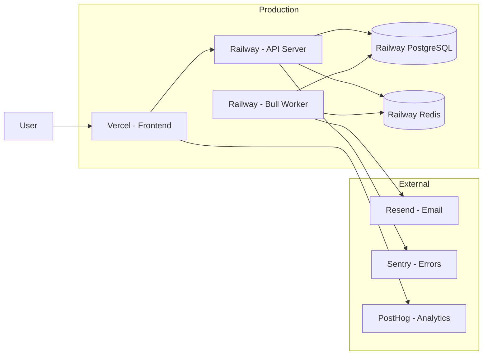
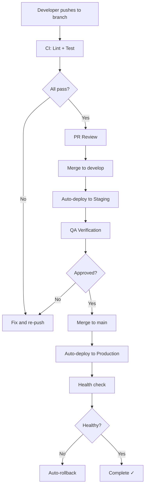

# Deployment Plan

## Document Info
- **Phase**: Deployment
- **Author**: PetReady Team
- **Date**: 2026-06-24
- **Status**: Draft

---

## 1. Deployment Architecture



---

## 2. Environments

| Environment | Purpose | URL | Deploy Trigger |
|-------------|---------|-----|---------------|
| Local | Development | localhost:3000/3001 | Manual |
| Staging | Testing & QA | staging.petready.app | Push to `develop` |
| Production | Live users | petready.app | Push to `main` |

---

## 3. Deployment Process



---

## 4. Vercel Configuration (Frontend)

```json
{
  "buildCommand": "pnpm --filter web build",
  "outputDirectory": "apps/web/.next",
  "installCommand": "pnpm install",
  "framework": "nextjs",
  "regions": ["iad1"],
  "env": {
    "NEXT_PUBLIC_API_URL": "@api-url",
    "NEXTAUTH_SECRET": "@nextauth-secret"
  }
}
```

---

## 5. Railway Configuration (Backend)

### API Service
```toml
[build]
builder = "nixpacks"
buildCommand = "pnpm --filter api build"

[deploy]
startCommand = "pnpm --filter api start"
healthcheckPath = "/health"
healthcheckTimeout = 5
restartPolicyType = "on_failure"
```

### Worker Service
```toml
[build]
builder = "nixpacks"
buildCommand = "pnpm --filter api build"

[deploy]
startCommand = "pnpm --filter api start:worker"
restartPolicyType = "on_failure"
```

---

## 6. Database Migrations

```bash
# Run migrations before deploy
pnpm --filter api db:migrate

# Rollback if needed
pnpm --filter api db:rollback
```

Migration strategy:
- Forward-only migrations (no destructive changes in production)
- Backward-compatible changes first, remove old columns in next release
- Always test migrations on staging first

---

## 7. Monitoring & Alerts

| Metric | Tool | Alert Threshold |
|--------|------|----------------|
| API response time | Railway metrics | p95 > 500ms |
| Error rate | Sentry | > 1% of requests |
| Uptime | UptimeRobot | < 99.5% over 24h |
| Database connections | Railway | > 80% pool used |
| Redis memory | Railway | > 80% capacity |
| Queue depth | Bull Board | > 1000 pending jobs |

---

## 8. Rollback Strategy

| Scenario | Action | Recovery Time |
|----------|--------|--------------|
| Frontend broken | Vercel instant rollback (previous deployment) | < 1 min |
| API broken | Railway rollback to previous image | < 2 min |
| Bad migration | Run rollback script, redeploy previous API | < 10 min |
| Data corruption | Restore from daily backup | < 4 hours |

---

## 9. Domain & SSL

| Domain | Points To | SSL |
|--------|-----------|-----|
| petready.app | Vercel (frontend) | Auto (Let's Encrypt) |
| api.petready.app | Railway (API) | Auto |
| staging.petready.app | Vercel preview | Auto |

---

## 10. Launch Checklist

- [ ] All environment variables set in production
- [ ] Database migrations applied
- [ ] Redis provisioned and connected
- [ ] Push notification VAPID keys generated
- [ ] Email sending verified (Resend domain authenticated)
- [ ] Error tracking active (Sentry DSN configured)
- [ ] Analytics tracking active (PostHog)
- [ ] Health check endpoint responding
- [ ] SSL certificates active
- [ ] Rate limiting enabled
- [ ] CORS configured for production domain only
- [ ] Backup schedule confirmed
- [ ] Monitoring alerts configured
- [ ] Rollback tested on staging
