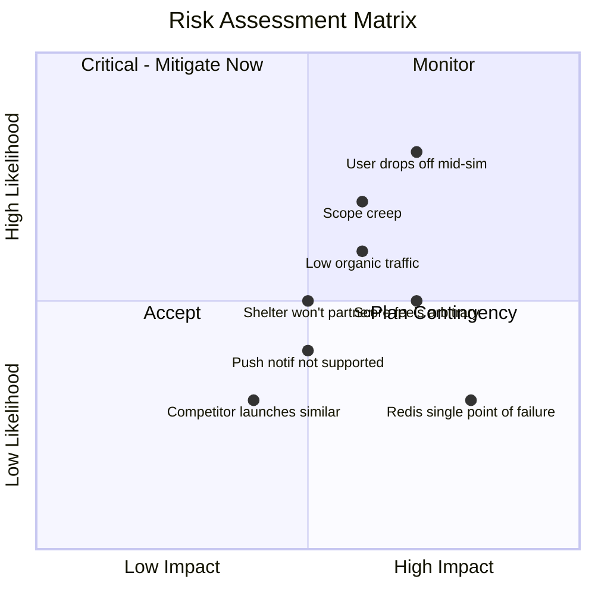

# Risk Register

## Document Info
- **Phase**: Project Management
- **Author**: PetReady Team
- **Date**: 2026-06-24
- **Status**: Draft

---

## 1. Risk Matrix

---

## 2. Detailed Risk Register

### RISK-001: Users abandon simulation mid-way
| Attribute | Detail |
|-----------|--------|
| **Category** | User Engagement |
| **Likelihood** | High (70%) |
| **Impact** | High — core value prop fails |
| **Mitigation** | Shorter 3-day option, daily progress emails, gamification badges, "you're 67% done!" nudges |
| **Contingency** | Offer partial results for incomplete sims (minimum 2 days) |
| **Owner** | Product |
| **Status** | Open |

### RISK-002: Push notifications ignored or blocked
| Attribute | Detail |
|-----------|--------|
| **Category** | Technical |
| **Likelihood** | Medium (40%) |
| **Impact** | High — simulation doesn't work without notifications |
| **Mitigation** | Email fallback (30min delay), in-app dashboard as backup, clear value prop for enabling notifications |
| **Contingency** | SMS fallback (Phase 2), allow manual "check-in" mode |
| **Owner** | Engineering |
| **Status** | Open |

### RISK-003: Readiness score feels arbitrary to users
| Attribute | Detail |
|-----------|--------|
| **Category** | Product Trust |
| **Likelihood** | Medium (50%) |
| **Impact** | High — users won't trust or share results |
| **Mitigation** | Transparent methodology (show weights), cite research sources, link specific evidence to each score factor |
| **Contingency** | A/B test different scoring displays, add "validated by veterinary professionals" credibility |
| **Owner** | Product |
| **Status** | Open |

### RISK-004: Scope creep delays MVP
| Attribute | Detail |
|-----------|--------|
| **Category** | Project Management |
| **Likelihood** | High (70%) |
| **Impact** | Medium — delayed launch, budget overrun |
| **Mitigation** | Strict P0-only MVP scope, weekly scope review, "Phase 2" parking lot for nice-to-haves |
| **Contingency** | Cut to 3-day sim only, single pet type (dog), defer gamification |
| **Owner** | Project Lead |
| **Status** | Open |

### RISK-005: Low organic traffic at launch
| Attribute | Detail |
|-----------|--------|
| **Category** | Growth |
| **Likelihood** | Medium-High (60%) |
| **Impact** | Medium — slow validation of product-market fit |
| **Mitigation** | SEO content (pet care guides), social sharing of results, shelter partnerships for referral traffic |
| **Contingency** | Paid ads on pet adoption keywords ($500 test budget), Reddit/social community posts |
| **Owner** | Marketing |
| **Status** | Open |

### RISK-006: Redis failure loses queued tasks
| Attribute | Detail |
|-----------|--------|
| **Category** | Infrastructure |
| **Likelihood** | Low (20%) |
| **Impact** | Critical — active simulations break |
| **Mitigation** | Redis persistence (AOF mode), task schedule stored in PostgreSQL as source of truth, worker can rebuild queue from DB |
| **Contingency** | Rebuild queue from DB state on Redis recovery, notify affected users |
| **Owner** | Engineering |
| **Status** | Open |

### RISK-007: Shelters won't adopt the tool
| Attribute | Detail |
|-----------|--------|
| **Category** | Business |
| **Likelihood** | Medium (50%) |
| **Impact** | Medium — B2B revenue stream blocked |
| **Mitigation** | Prove value with data first (show reduced return rates for PetReady users), offer free pilot |
| **Contingency** | Focus on B2C (premium reports, affiliate revenue) |
| **Owner** | Business Development |
| **Status** | Open |

### RISK-008: Competitor launches similar product
| Attribute | Detail |
|-----------|--------|
| **Category** | Market |
| **Likelihood** | Low-Medium (30%) |
| **Impact** | Medium — market share competition |
| **Mitigation** | First-mover advantage, build data moat (simulation completion data), shelter relationships |
| **Contingency** | Differentiate on depth (more scenarios, better scoring, community) |
| **Owner** | Strategy |
| **Status** | Open |

### RISK-009: Single developer burnout / bus factor
| Attribute | Detail |
|-----------|--------|
| **Category** | Team |
| **Likelihood** | Medium (50%) |
| **Impact** | Critical — project stalls |
| **Mitigation** | Clear documentation (this repo), modular architecture, regular breaks, scope discipline |
| **Contingency** | Documented enough for handoff, consider co-founder/contractor for Phase 2 |
| **Owner** | Founder |
| **Status** | Open |

### RISK-010: Data privacy / GDPR complaint
| Attribute | Detail |
|-----------|--------|
| **Category** | Legal |
| **Likelihood** | Low (20%) |
| **Impact** | High — legal action, reputation damage |
| **Mitigation** | Minimal data collection, clear privacy policy, GDPR compliance built-in (delete endpoint), no selling data |
| **Contingency** | Legal counsel on retainer, data processing agreement template ready |
| **Owner** | Legal |
| **Status** | Open |

---

## 3. Risk Response Summary

| Risk Level | Count | Response Strategy |
|-----------|-------|-------------------|
| Critical (High/High) | 2 | Active mitigation + contingency plan |
| High (Medium/High or High/Medium) | 4 | Active mitigation |
| Medium | 3 | Monitor + planned response |
| Low | 1 | Accept + document |

---

## 4. Risk Review Schedule

- **Weekly**: Review top 3 risks during sprint planning
- **Bi-weekly**: Full register review, update likelihoods
- **Monthly**: Add new risks identified during development
- **Post-launch**: Re-assess all risks with real data
