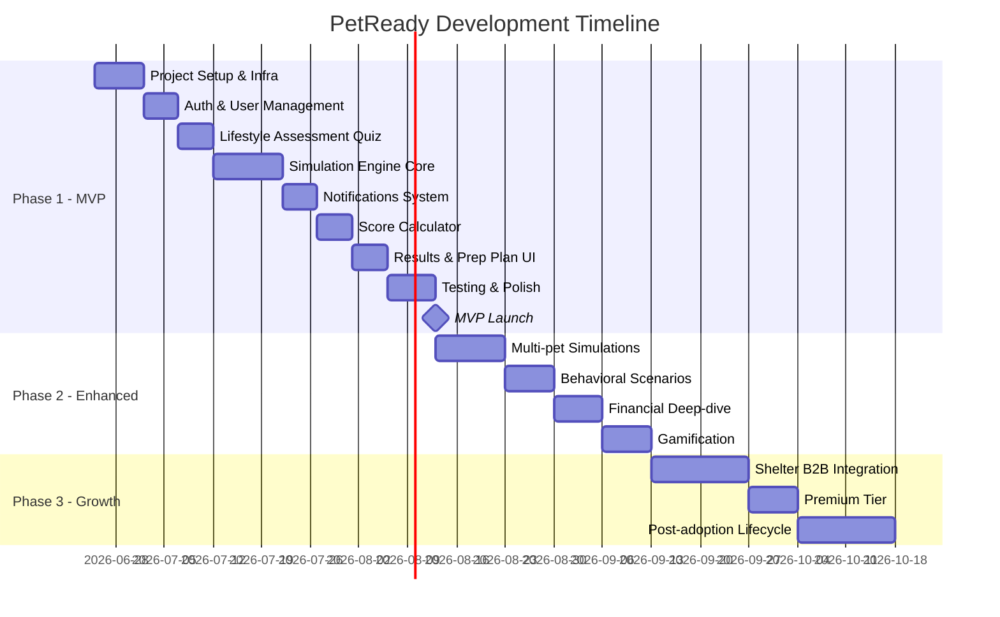

# Project Timeline

## Document Info
- **Phase**: Project Management
- **Author**: PetReady Team
- **Date**: 2026-06-24
- **Status**: Draft

---

## 1. Release Plan Overview

---

## 2. Phase 1 — MVP (8 weeks)

### Sprint 1: Foundation (Week 1–2)

| Task | Deliverable | Days |
|------|-------------|------|
| Monorepo setup (Turborepo) | Working dev environment | 1 |
| Docker Compose (PG + Redis) | Local infrastructure | 1 |
| Database schema + migrations | All tables created | 2 |
| Express API scaffold | Health check, middleware, error handling | 1 |
| Next.js app scaffold | Landing page, layout, Tailwind config | 1 |
| Auth system (NextAuth + JWT) | Register, login, OAuth, protected routes | 3 |
| CI pipeline (GitHub Actions) | Lint + test + build on every PR | 1 |

**Exit criteria**: User can register, login, and access protected dashboard.

### Sprint 2: Assessment (Week 3)

| Task | Deliverable | Days |
|------|-------------|------|
| Quiz question data model | 12 questions with types and options | 1 |
| Quiz UI component | Progressive question display, progress bar | 2 |
| Assessment API | POST/GET assessment endpoints | 1 |
| Pet recommendation logic | Suggest pet based on answers | 1 |

**Exit criteria**: User completes quiz, sees recommended pet type.

### Sprint 3: Simulation Engine (Week 4–5)

| Task | Deliverable | Days |
|------|-------------|------|
| Task scheduler service | Generate 3-day schedule with timezone support | 3 |
| Bull queue integration | Schedule/cancel delayed jobs | 2 |
| Task notification delivery | Push notification on job fire | 2 |
| Task completion API | PATCH endpoint, response time tracking | 1 |
| Event generator | Random event creation + scheduling | 2 |

**Exit criteria**: User receives timed notifications, can complete tasks, experiences random events.

### Sprint 4: Notifications (Week 5–6)

| Task | Deliverable | Days |
|------|-------------|------|
| Web Push subscription | Service worker, permission flow | 2 |
| Email fallback (Resend) | Send email after 30min no-response | 1 |
| Notification preferences | Quiet hours, channel preferences | 1 |
| Simulation dashboard UI | Live task list, progress, expenses | 3 |

**Exit criteria**: Notifications work reliably across channels.

### Sprint 5: Scoring & Results (Week 6–7)

| Task | Deliverable | Days |
|------|-------------|------|
| Score calculation algorithm | Weighted formula implementation | 2 |
| Results API | GET endpoint with full breakdown | 1 |
| Results page UI | Score gauge, breakdown bars, recommendations | 3 |
| Preparation plan generation | Personalized checklist from gaps | 2 |
| Share functionality | Public share URL with token | 1 |

**Exit criteria**: Completed simulation shows full scored results with actionable plan.

### Sprint 6: QA & Launch Prep (Week 8)

| Task | Deliverable | Days |
|------|-------------|------|
| Integration test suite | All critical API paths covered | 2 |
| E2E test suite (Puppeteer) | 10 critical flows automated | 2 |
| Performance optimization | Lighthouse >80, bundle analysis | 1 |
| Production deployment | Vercel + Railway configured | 1 |
| Launch checklist verification | All items green | 1 |

**Exit criteria**: MVP live at petready.app, all tests passing, monitoring active.

---

## 3. Phase 2 — Enhanced (6 weeks post-launch)

| Week | Focus |
|------|-------|
| 9–10 | Multi-pet simulations (cat, bird, rabbit unique tasks) |
| 11 | Behavioral scenario library (20+ scenarios) |
| 12 | Financial deep-dive (budget planner, insurance comparison) |
| 13 | Gamification (badges, streaks, leaderboard) |
| 14 | Community features (forum, success stories) |

---

## 4. Phase 3 — Growth (Ongoing)

| Month | Focus |
|-------|-------|
| Month 4 | Shelter API integration (Petfinder, AdoptAPet) |
| Month 5 | B2B dashboard for shelters |
| Month 6 | Premium tier launch ($9.99 detailed report) |
| Month 7+ | Post-adoption lifecycle tools, partnerships |

---

## 5. Milestones

| Date | Milestone | Success Metric |
|------|-----------|---------------|
| Week 2 | Auth + infra working | Can register/login |
| Week 5 | Simulation running | Receive first notification |
| Week 7 | Full flow complete | Quiz → Sim → Score works |
| Week 8 | **MVP Launch** | Live with 0 critical bugs |
| Week 10 | 100 beta users | >40% simulation completion |
| Week 14 | Phase 2 complete | 5 pet types, 20+ scenarios |
| Month 6 | First revenue | 10 paying users or 1 shelter partner |
